# Java-Parts
Simple Demonstrations about Java language

<h1 align="center">


<b style="color:red">Java</b> Language
<b style="color:#095eba; border-bottom:5px solid #19a539">IN ONE Video</b>
</h1>
<hr/>
<p style="text-align:center">

<br/>
<a href="https://en.wikipedia.org/wiki/James_Gosling">Creator of JAVA</a>
</p>

## History
<hr/>


- Created at **Sun Microsystems** under the project name "Oak".
- Name Change to **Java** (1995) inspired by **Java coffee**.
- Sun Microsystems officially announced Java to the public in 1995 with the slogan **"Write Once, Run Anywhere" (WORA)**.
- In 2009, **Oracle Corporation** acquired **Sun Microsystems**, and Java became part of Oracle’s software offerings.


##  Java Features
<hr/>


➢ Simple, familiar to developers from C and C++ backgrounds.

➢ Object-Oriented(OOP)  Java is purely object-oriented, meaning everything in Java is treated as an object.

➢ Platform-Independent (WORA) - Write Once, Run Anywhere, Java programs are compiled into **bytecode** that can run on any machine with a **Java Virtual Machine (JVM)**.

➢ Other features like **Multithreading, Secure, Portable**.

➢ Create Desktop, Mobile(Android), Web App, Micro App(Embedded Apps), IOT, AI and more.

<hr/>

## Setting Up & Installing Java
<hr/>

**JDK** stands for Java Development Kit, and it is a software development kit used to develop Java applications.
The JDK provides everything you need to write, compile, and run Java programs, including

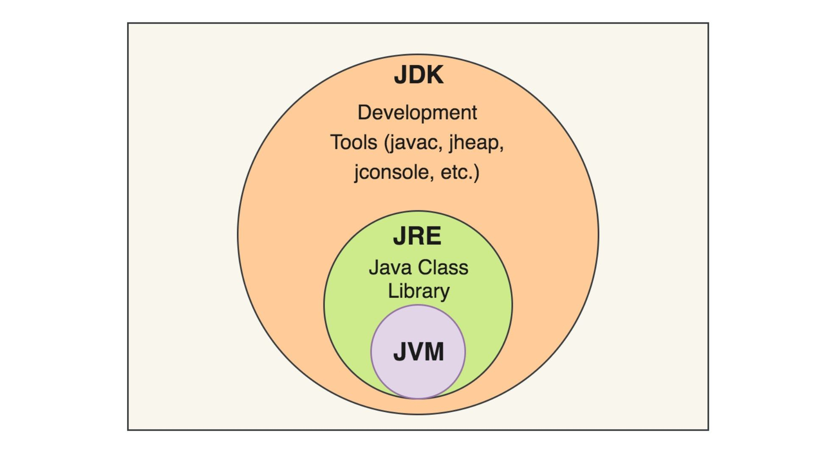

1. **Java Compiler (javac)**.
2. **Tools for Development & Documentation**.
3. **Java Runtime Environment (JRE)** contains the necessary libraries and the JVM to run Java applications.
4. **JVM (Java Virtual Machine) that runs Java bytecode**.


> JDK contains Tools (like compiler) & JRE
>
> JRE contains  Class Library & JVM
>
> JVM contains All components to load and run java


### IDE
<hr/>

**Integrated Development Environment needed for writing Java code**.
- NotePad, NotePad++
- Eclipse
- Netbeans
- Intellij
- More and more........


- Download JDK <a>https://adoptium.net/temurin/releases </a>
- Download Intellij <a>https://www.jetbrains.com/idea/download </a>


## Hello World & Program Structure
<hr/>

Writing simple code using Java and display hello world message into the console using

```
public class Main {
    public static void main(String[] args) {

        System.out.println("Hello Java Developers!!");
    }
}
```

## Running Code using Commands
<hr/>

we can write code using notepad and compile it using java compiler.
> javac : is the compiler that get .java files and compile it into .class files.
> <br/>
> java : will run the class files

```
public class App{
  public static void main(String[] args) {
      System.out.println("Hello from Command Line!!");
   }
}

> javac App.java  ===== java compiler will compile App.java and create App.class file.
> java  App       ===== will add the .class file to the java runtime to run it.
```

The intermediate code called
- **class files.**
- **binary files.**
- **bytecode files.**

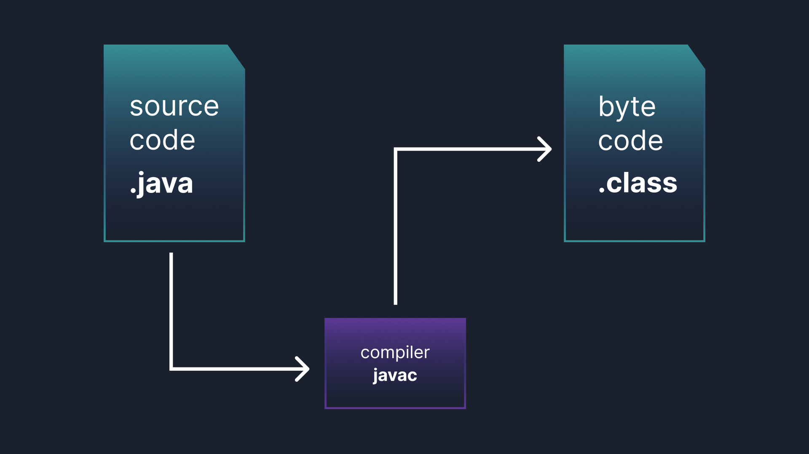

## Java Variables and Data Types
<hr/>

**variable** is a container used to store data values during the execution of a program.
- Each variable has a **type** that defines the kind of data it can store at memory.
- Each variable has a **name** to use it in the program.

#### In java we have 2 different data types
- primitive types.
- reference types(Objects variables) **in part 2 (OOP)**.

### primitive types
<hr/>
in Java we have 8 primitive types (byte, short, int, long, float, double, boolean, char)
used to store simple data like numbers and logical values and character.

**Note** String is not primitive type, it's reference Type(Object), **We will use the String in this Part**.
<hr/>


* **1 Byte =  8 bit**
* **2 Byte = 16 bit**
* **3 Byte = 24 bit**
* **4 Byte = 32 bit**
* **8 Byte = 64 bit**
* **The equation Is <b style="color:red">-2^(N-1) to 2^(N-1) - 1</b>**


### A variable is a name for a piece of memory that stores data.
- each variable has a name and a data type.
- An **identifier** is the name of a variable.
- Identifiers must begin with a letter, a $ symbol, or a _ symbol.
- Identifiers can include **numbers** but **not start with them**.
- You cannot use the same name as a **Java reserved word.**
- A **reserved word** is special word that Java has held aside so that you are not allowed to use it.
```
int numberAnimals;    // correct
byte boxSize = 10;    // correct
char info = 'A';      // correct
boolean $ = true;     // correct
double _into = 12.4;  // correct
int size800 = 100;    // correct
int in fo = 100;      // not correct, include spaces
byte int = 100;       // not correct, reserved word
int 5info = 19;       // not correct, start with number

```


## Writing Comments in Java code
<hr/>

Include a summary at the beginning of the program that explains what the program does

- single line comment using //
- multiline comment(block comments) using /* */
- javadoc style comments using /** */

**javadoc** style  can be extracted into an HTML file using the
JDK’s javadoc command


## Operators in Java (Arithmetic, Relational, Logical, ....)
<hr/>

- Addition, Subtraction, Multiplication, Division, Modulus (+, -, *, /, %)
- Relational operators like  <, >, <=, >=, ==, instanceof.
- Logical operators like &, ^, |
- Short-circuit logical operators &&, ||
- Assignment operators =, +=, -=, *=, /=,
- Post-unary operators expression++, expression--
- Pre-unary operators ++expression, --expression
- ! Inverts a boolean’s logical value true = !false
<hr/>

**example of modules %**

```
System.out.println(9 / 3); // 3
System.out.println(9 % 3); // 0

System.out.println(10 / 3); // 3
System.out.println(10 % 3); // 1

System.out.println(11 / 3); // 3
System.out.println(11 % 3); // 2

System.out.println(12 / 3); // 4
System.out.println(12 % 3); // 0
```


## Control Flow Statements
<hr/>

### if Statements
<hr/>

An if statement is a construct that enables a program to specify alternative paths of execution.

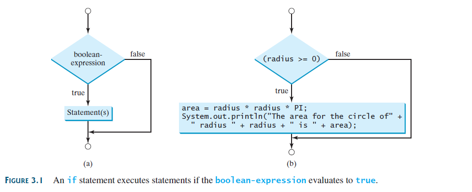

```
int radius = 5;
if (radius > 0) {
    System.out.println("radius is positive");
}

```

### Two-Way if-else Statements
<hr/>
An if-else statement decides the execution path based on whether the condition is
true or false.

A one-way if statement performs an action if the specified condition is true. If the condition
is false, nothing is done. But what if you want to take alternative actions when the condition
is false? You can use a two-way if-else statement.


```
int radius = -5;
if (radius > 0) {
    System.out.println("radius is positive!!");
}else{
    System.out.println("Radius is negative!!");
}

```

### Multi-Way if else if else Statements
<hr/>

based on specific condition make something

```
    int radius = 100;
    
    if(radius > 10) {
        
        System.out.println("Radius > 10");
        
    }else if(radius > 5) {
        System.out.println("Radius > 5");
    }else if(radius > 0) {
        System.out.println("Radius > 0");
    }else {
        System.out.println("Radius <= 0");
    }

```

### Switch Statements
<hr/>

A switch statement executes statements based on the value of a variable or an
expression.

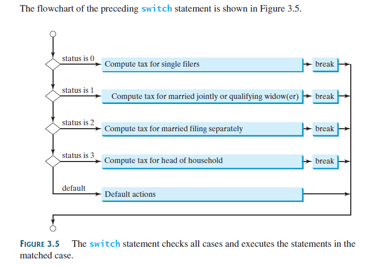

```
        int day = 3; // Example value
        // Switch statement to print the name of the day
        switch (day) {
            case 1:
                System.out.println("Monday");
                break;
            case 2:
                System.out.println("Tuesday");
                break;
            case 3:
                System.out.println("Wednesday");
                break;
            case 4:
                System.out.println("Thursday");
                break;
            case 5:
                System.out.println("Friday");
                break;
            case 6:
                System.out.println("Saturday");
                break;
            case 7:
                System.out.println("Sunday");
                break;
            default:
                System.out.println("Invalid day");
        }

```

### Conditional Expressions
<hr/>

A conditional expression evaluates an expression based on a condition.

```
if (x > 0)
    y = 1;
else
    y = -1;
    
// we can write this using conditional operator
y = (x > 0) ? 1 : -1;    
```


## Loops
<hr/>

**A loop can be used to tell a program to execute statements repeatedly.**

Suppose that you need to display a string (e.g., Welcome to Java!) a hundred times.

### The while Loop

A while loop executes statements repeatedly while the condition is true.

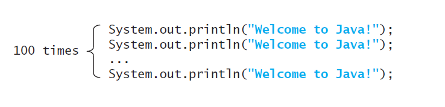
<hr/>

```
while (loop-continuation-condition) {
          // Loop body
          Statement(s);
}
```


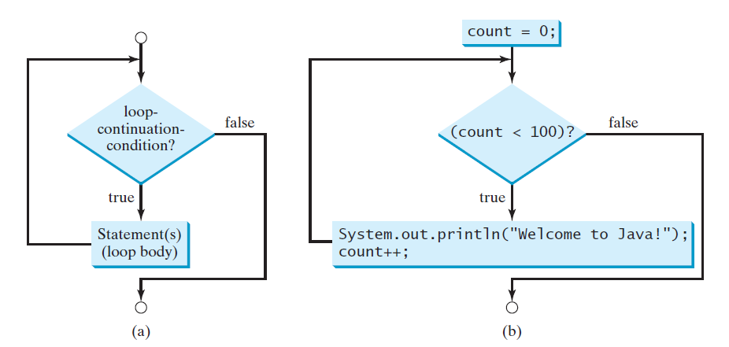

```
int count = 0;
while (count < 100) {   // loop-continuation-condition
    System.out.printIn("Welcome to Java!"); //loop body
    count++;
}
```

### The do-while Loop
<hr/>

A do-while loop is the same as a while loop except that it executes the loop body
first and then checks the loop continuation condition.

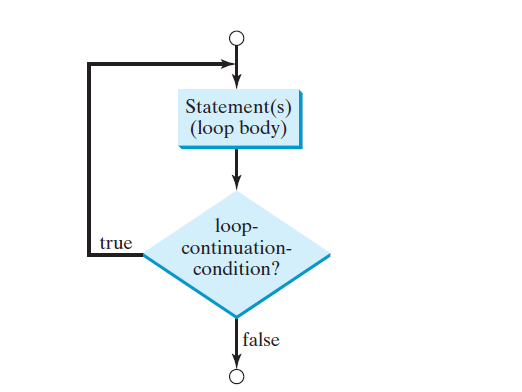


### The For Loop
<hr/>

A for loop has a concise syntax for writing loops.

```
for (initial-value; loop-condition; after-each-iteration) {
      // Loop body;
      Statement(s);
}

```

### Nested Loops

A loop can be nested inside another loop.
Nested loops consist of an outer loop and one or more inner loops.


```
      for (int i = 1; i <= 9; i++) {
            System.out.print(i + " | ");
            for (int j = 1; j <= 9; j++) {
                // Display the product and align properly
                System.out.printf("%4d", i * j);
            }
            System.out.println();
        }
```


**Loops are fundamental in programming. The ability to write loops is essential in
learning Java programming.**
--------------

## Declaring Methods
<hr/>

**Methods can be used to define reusable code and organize and simplify coding.**

Suppose that you need to find the sum of integers **from** **1 to 10**, **from 20 to 37, and from 35
to 49, respectively.**


### Defining a Method

A method definition consists of its method name, parameters, return value type, and body.

```
returnType methodName(parameters) {
    // method body
}
// return type is data type(int, float, double, so on), may be void
// parameters is optional zero or more parameters
// method body
// return statement is optional

```

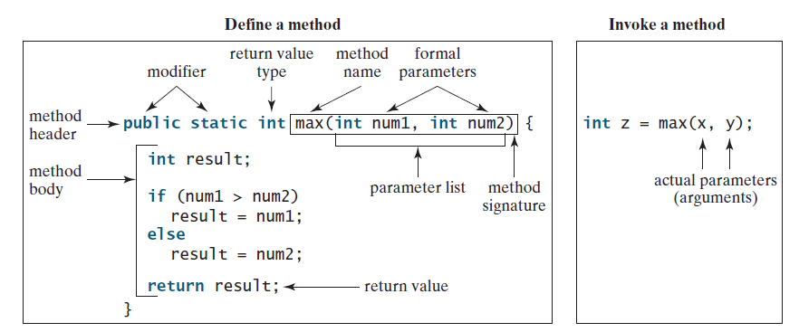

<hr/>

## Arrays & Usage
<hr/>

**A single array variable can reference a large collection of data.**


Often you will have to store a large number of values during the execution of a program.

you can store all 100 numbers into an array and access them
through a single array variable.

- **Its size is fixed.**
- **access the elements in an array using an index.**
- **Index in Array start from 0**

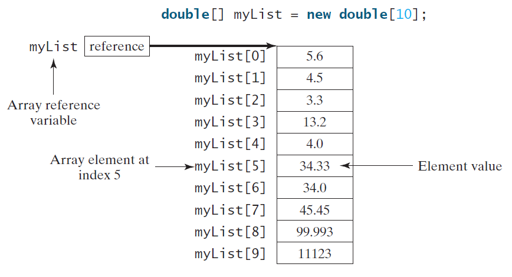

### Declaring Array Variables

>elementType[] arrayRefVar;

```
elementType[] arrayRefVar = new elementType[arraySize];
int []arr = new int[5];
int arr[] = new int[5];

arr[0] = 120;
arr[1] = 1000;
arr[2] = 100;
arr[3] = 34;
arr[4] = 4;

arr[5] = 17; // will throw exception because the max index is 4 as the size is 5

```

### Array Size and Default Values

When space for an array is allocated, the array size must be given, specifying the number of elements
that can be stored in it.

**The size of an array cannot be changed after the array is created.
Size can be obtained using arrayRefVar.length**

>Its elements are assigned the default value of 0 for the numeric
primitive data types, \u0000 for char types, and false for boolean types.


### How to iterate on Array
<hr/>

You can use any type of loop(while, do-while, for)

```
  int [] arr = new int[5];
  arr[0] = 10;
  arr[1] = 15;
  arr[2] = 14;
  arr[3] = 100;
  arr[4] = 80;
  for(int i = 0; i < arr.length; i++) {
    System.out.println(arr[i]);
  }
```

We can use another type of Loops called
- **for-each**
- **enhanced for loop**

```
  int [] arr = new int[5];
  arr[0] = 10;
  arr[1] = 15;
  arr[2] = 14;
  arr[3] = 100;
  arr[4] = 80;
  for(int element: arr) {
    System.out.println(element);
  }
```

**enhanced for loop used with Arrays and collection framework.**

<hr/>

### Searching Arrays
<hr/>

If an array is sorted, binary search is more efficient than linear search for finding an
element in the array.
- LinearSearch
- BinarySearch when the array is sorted


## Introduction to OOP

Object-oriented programming (OOP) involves programming using objects.

An object represents
an entity in the real world that can be distinctly identified.

**a student, a desk, a circle, a button, and even a loan** can all be viewed as objects


each Object contains
- properties or attributes or states
- functions or behavior or methods

**Object is instance of specific class.**

**A class is a template, blueprint, or contract that defines what an object’s data fields and methods will be**

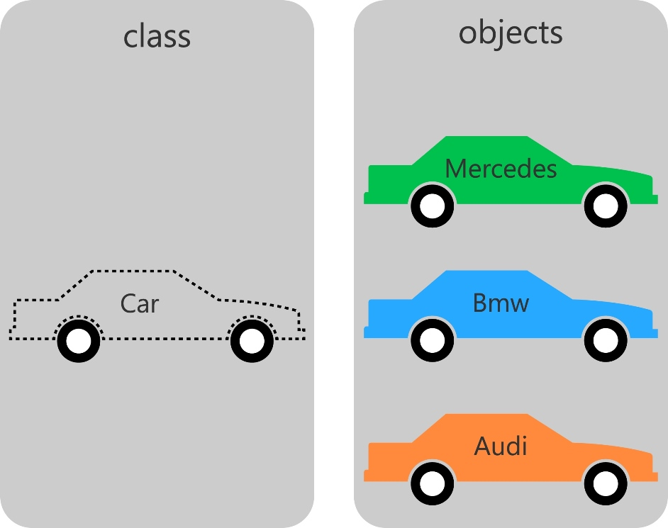

<hr/>

## String class in JAVA
<hr/>

A string is a sequence of characters.

The char type represents only one character. To represent a string of characters, use the data
type called String.

> String message = "Welcome to Java";
> String message = new String("Welcome to Java");

String is a predefined class in the Java library.

**The String type is not a primitive type. It is known as a reference type.**


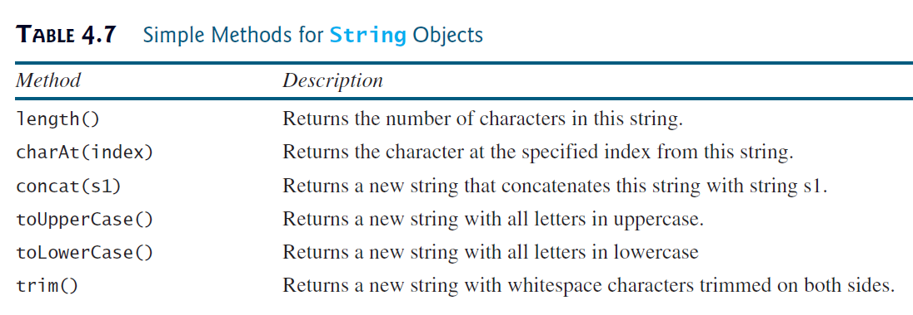


## Java Input and Output
<hr/>

How to read data from The console and write data into Console.